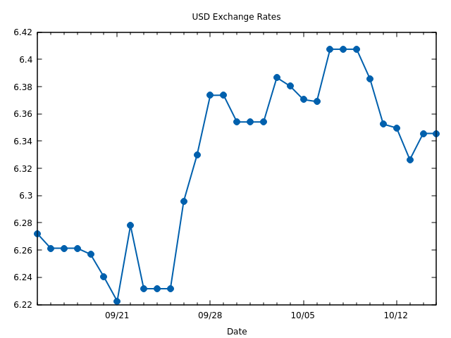

HNB Exchange Rate CLI
=====================

Displays exchange rates for Euro (EUR) or to legacy Croatian Kuna (HRK) from the Croatian National
Bank (HNB). Data is fetched from the [HNB API](https://api.hnb.hr/).

.. image:: https://img.shields.io/badge/author-%40ihabunek-blue.svg?maxAge=3600&style=flat-square
   :target: https://mastodon.social/@ihabunek
.. image:: https://img.shields.io/github/license/ihabunek/hnbex-cli.svg?maxAge=3600&style=flat-square
   :target: https://opensource.org/licenses/GPL-3.0
.. image:: https://img.shields.io/pypi/v/hnbex-cli.svg?maxAge=3600&style=flat-square
   :target: https://pypi.python.org/pypi/hnbex-cli

Installation
------------

Requires **Python 3.7** or greater.

Drawing charts requires `gnuplot <http://www.gnuplot.info/>`_.

Install from the Python Package Index:

.. code-block::

    pip install hnbex-cli

Usage
-----

Commands:

* ``daily``   - Show daily exchange rates for all currencies
* ``range``   - Show exchange rates for a single currency in the given date range
* ``chart``   - Draw exchange rate chart for a single currency
* ``convert`` - Convert between currencies

Daily
~~~~~

Show rates for all currencies on a given date (if not given, date defaults to today):

.. code-block::

    $ hnbex daily 2023-07-15

.. code-block::

    HNB exchange rates on 2023-07-14

    Currency   Buying   Median  Selling  Spread
    --------  -------  -------  -------  ------
         AUD   1.6323   1.6299   1.6275  -0.29%
         CAD   1.4736   1.4714   1.4692  -0.30%
         CZK   23.788   23.752   23.716  -0.30%
         DKK   7.4635   7.4523   7.4411  -0.30%
         HUF   375.71   375.15   374.59  -0.30%
         JPY   155.07   154.84   154.61  -0.30%
         NOK  11.2649  11.2480  11.2311  -0.30%
         SEK  11.5273  11.5100  11.4927  -0.30%
         CHF   0.9658   0.9644   0.9630  -0.29%
         GBP  0.85681  0.85553  0.85425  -0.30%
         USD   1.1199   1.1182   1.1165  -0.30%
         BAM  1.95876  1.95583  1.95290  -0.30%
         PLN   4.4389   4.4323   4.4257  -0.30%

Range
~~~~~

Show rates for a single currency, for range of days.

The range defaults to the last 30 days, and can be changed by giving one or more of:

* ``--start`` or ``-s`` - the first day of the range (default calculated as ``end - days``)
* ``--end`` or ``-e`` - the last day of the range (defaults to tomorrow)
* ``--days`` or ``-d`` - number of days in the range (defaults to 30)

.. code-block::

    $ hnbex range usd -d 10

.. code-block::

    HNB exchange rates for USD from 2023-07-06 to 2023-07-15

          Date  Buying  Median  Selling    Diff
    ----------  ------  ------  -------  ------
    2023-07-06  1.0895  1.0879   1.0863
    2023-07-07  1.0915  1.0899   1.0883  +0.18%
    2023-07-08  1.0904  1.0888   1.0872  -0.10%
    2023-07-09  1.0904  1.0888   1.0872   0.00%
    2023-07-10  1.0904  1.0888   1.0872   0.00%
    2023-07-11  1.0972  1.0956   1.0940  +0.62%
    2023-07-12  1.1005  1.0989   1.0973  +0.30%
    2023-07-13  1.1039  1.1022   1.1005  +0.30%
    2023-07-14  1.1199  1.1182   1.1165  +1.45%
    2023-07-15  1.1238  1.1221   1.1204  +0.35%

Chart
~~~~~

This command requires `gnuplot <http://www.gnuplot.info/>`_ to be installed.

Draw a chart of exchange rate movement for range of days. Options are identical as ``hnbex range``.

.. code-block::

    $ hnbex chart usd

.. code-block::

                                  USD Exchange Rates

    6.42 +-+--+-+-+-+--+-+-+-+--+-+-+-+--+-+-+--+-+-+-+--+-+-+-+--+-+-+-+--+-+
         |             +              +               +    x*x*x**    +      |
     6.4 +-+                                              *                +-+
    6.38 +-+                                      x*x*    *       x        +-+
         |                            x**x       *    x**x         *         |
    6.36 +-+                          *   *      *                 *       +-+
         |                           *     x*x**x                   x*x    x*x
    6.34 +-+                         *                                 * **+-+
         |                          x                                   x    |
    6.32 +-+                       *                                       +-+
     6.3 +-+                       *                                       +-+
         |                        x                                          |
    6.28 +-+             x        *                                        +-+
         x*x**x*x*       **      *                                           |
    6.26 +-+      x*    * *      *                                         +-+
    6.24 +-+        x** *  *    *                                          +-+
         |             *   x*x**x     +               +               +      |
    6.22 +-+--+-+-+-+--x-+-+-+--+-+-+-+--+-+-+--+-+-+-+--+-+-+-+--+-+-+-+--+-+
                     09/21          09/28           10/05           10/12
                                         Date

Also supports graphical charts:

.. code-block::

    $ hnbex chart usd --template qt

Which displays the chart:

Convert
~~~~~~~

Convert between HRK and anouther currency, using EUR as a middle-currency, and the official
EUR to HRK exchange rate:

.. code-block::

    $ hnbex convert 150 hrk usd

.. code-block::

    150 HRK = 22.26 USD

    Using the median rate 1 USD = 6.296589 HRK defined on 2017-08-21 and fixed rate 1 EUR = 7.5345 HRK

Use ``--euro`` or ``-e`` option to show intermediate value in EUR. Ignored for conversions not from/to HRK.

.. code-block::

    $ hnbex convert 150 hrk usd -e

.. code-block::

    150 HRK = 19.91 EUR = 22.26 USD

    Using the median rate 1 USD = 6.296589 HRK defined on 2017-08-21 and fixed rate 1 EUR = 7.5345 HRK

When converting to EUR, the target currency can be ommited:

.. code-block::

    $ hnbex convert 500 jpy

.. code-block::

    500 JPY = 3.23 EUR

    Using the median rate 1 EUR = 154.84 JPY defined on 2023-07-14

If ``--value-only`` or ``-v`` option is used, only the resulting value will be output.

.. code-block::

    $ hnbex convert 500 jpy -v

.. code-block::

    3.23

The resulting value is rounded to 2 decimal places by default but can be changed by using the ``-p`` or ``--precision`` option:

.. code-block::

    $ hnbex convert 500 jpy -p 10 -v

.. code-block::

    3.2291397572

License
-------

Copyright © 2017-2023 Ivan Habunek <ivan@habunek.com>

Licensed under the GPLv3: http://www.gnu.org/licenses/gpl-3.0.html

Contributors
~~~~~~~~~~~~

Neven Falica <nfalica@gmail.com> - 2023 update
